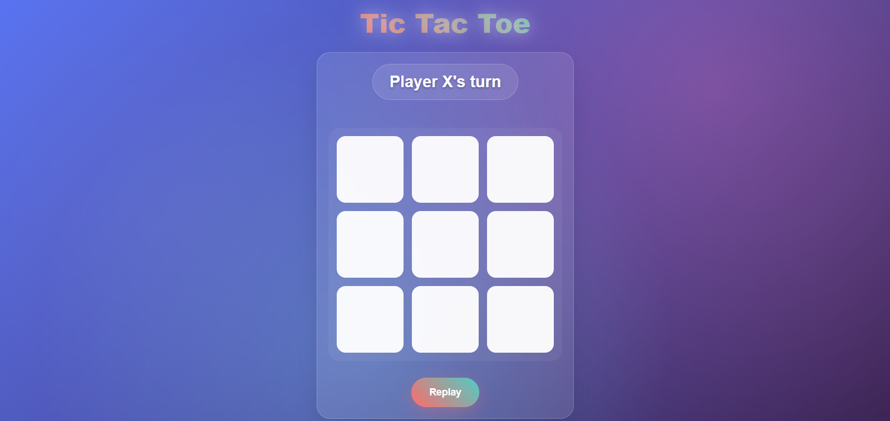

# 🎮 x-and-o-game

Un jeu **Tic Tac Toe (X et O)** interactif et moderne développé avec **HTML**, **CSS** et **JavaScript Vanilla**. Jouez à deux joueurs en local, dans une interface fluide, responsive et stylée.

---

## 📸 Aperçu du jeu



---

## ✨ Fonctionnalités

- 🎮 Jeu à deux joueurs (X vs O)
- ✅ Détection automatique du gagnant ou égalité
- 📱 Design responsive (mobile/tablette/PC)
- 🌀 Interface animée et moderne (hover, transitions)
- 🔁 Bouton pour recommencer une partie

---
## 📁 Project Structure

```
```
x-and-o-game/
│
├── x-and-o-game.html         # Main HTML file
├── css/
│   └── x-and-o-game.css      # CSS styling
├── js/
│   └── x-and-o-game.js       # Game logic
├── image/
│   └── screenshot.png        # App screenshot
└── README.md                 # Project documentation
```
```
